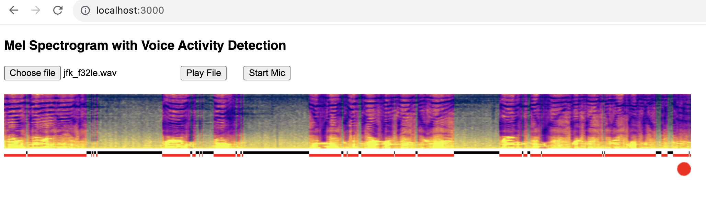
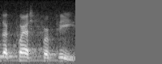
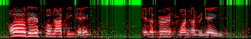
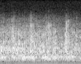
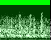
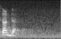
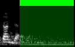
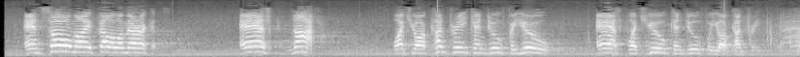

# Mel Spec

A Rust implementation of mel spectrograms aligned to the results from the
whisper.cpp, pytorch and librosa reference implementations and suited to
streaming audio.

Sep 21st: I'm in the process of fixing examples in particular whisper-rs
integration.

The browser example is currently working if selecting microphone input.

## Examples:

See [wavey-ai/hush](https://github.com/wavey-ai/hush) for live demo


* [stream microphone or wav to mel wasm worker](examples/browser)
* [stream from ffmpeg to whisper.cpp](examples/stream_whisper)
* [convert audio to mel spectrograms and save to image](examples/mel_tga)
* [transcribe images with whisper.cpp](examples/tga_whisper)

## Usage

To require the libary's main features:

```rust
use mel_spec::prelude::*
```

### Mel filterbank that has parity with librosa:

Mel filterbanks, within 1.0e-7 of librosa and identical to whisper
GGML model-embedded filters.

```rust
    let file_path = "./testdata/mel_filters.npz";
    let f = File::open(file_path).unwrap();
    let mut npz = NpzReader::new(f).unwrap();
    let filters: Array2<f32> = npz.by_index(0).unwrap();
    let want: Array2<f64> = filters.mapv(|x| f64::from(x));
    let sampling_rate = 16000.0;
    let fft_size = 400;
    let n_mels = 80;
    let f_min = None;
    let f_max = None;
    let hkt = false;
    let norm = true;
    let got = mel(sampling_rate, fft_size, n_mels, f_min, f_max, hkt, norm);
    assert_eq!(got.shape(), vec![80, 201]);
    for i in 0..80 {
        assert_nearby!(got.row(i), want.row(i), 1.0e-7);
    }
```

### Spectrogram using Short Time Fourier Transform

STFT with overlap-and-save that has parity with pytorch and
whisper.cpp.

The implementation is suitable for processing streaming audio and
will accumulate the correct amount of data before returning fft
results.

```rust
    let fft_size = 8;
    let hop_size = 4;
    let mut spectrogram = Spectrogram::new(fft_size, hop_size);

    // Add PCM audio samples
    let frames: Vec<f32> = vec![1.0, 2.0, 3.0];
    if let Some(fft_frame) = spectrogram.add(&frames) {
        // use fft result
    }
```

### STFT Spectrogram to Mel Spectrogram

MelSpectrogram applies a pre-computed filterbank to an FFT result.
Results are identical to whisper.cpp and whisper.py

```rust
    let fft_size = 400;
    let sampling_rate = 16000.0;
    let n_mels = 80;
    let mut mel = MelSpectrogram::new(fft_size, sampling_rate, n_mels);
    // Example input data for the FFT
    let fft_input = Array1::from(vec![Complex::new(1.0, 0.0); fft_size]);
    // Add the FFT data to the MelSpectrogram
    let mel_spec = stage.add(fft_input);
```

### Creating Mel Spectrograms from Audio.

Please refer to the test in RingBuffer [rb.rs](src/rb.rs)

This uses a simple synchronous approach to creating a spectrogram from live
or static data.


### Saving Mel Spectrograms to file

Mel spectrograms can be saved in Tga format - an uncompressed image format
supported by OSX and Windows.

As these images directly encode quantized mel spectrogram data they represent
a "photographic negative" of audio data that whisper.cpp can develop and print
without the need for direct audio input.

`tga` files are used in lieu of actual audio for most of the library tests. These
files are lossless in Speech-to-Text terms, they encode all the information that
is available in the model's view of raw audio and will produce identical results.

Note that spectrograms must have an even number of columns in the time domain,
otherwise Whisper will hallucinate. The library takes care of this if using the
core methods.

```rust
     let file_path = "../testdata/jfk_full_speech_chunk0_golden.tga";
     let dequantized_mel = load_tga_8bit(file_path).unwrap();
     // dequantized_mel can be sent straight to whisper.cpp
```

```
❯ ffmpeg -hide_banner -loglevel error -i ~/Downloads/JFKWHA-001-AU_WR.mp3 -f f32le -ar 16000 -acodec pcm_f32le -ac 1 pipe:1  | ./target/debug/tga_whisper -t ../../doc/cutsec_46997.tga
...
whisper_init_state: Core ML model loaded
Got 1
 the quest for peace.
```


_the quest for peace._

### Voice Activity Detection

I had the idea of using the Sobel operator for this as speech in Mel spectrograms
is characterised by clear gradients.

The general idea is to outline structure in the spectrogram and then find vertical
gaps that are suitable for cutting - to allow passing new spectrograms to the model
in near real-time.

It's particularly good at separating speech activity - this is important, because
anything resembling white noise is hallucinogenic to Whisper. The Voice Activity
Detector module therefore drops frames that look to be gaps in speech.

This is still not perfect and definitely a downside of stream processing, at least
with Whisper. However, pre-processing audio as spectrograms should be more robust
than pre-processing raw audio - with raw audio it's necessary to look for attack
transients to find boundaries, but it's not easy to tell if energy changes are
voice or something else. Mel spectrograms already provide a distinctive "voice"
signature.

The graphic below shows part of JFK's speech and uses Sobel edge detection to find
possible word/speech boundaries. As you can see, it works pretty well:



For reference, the settings used for this example are:

```rust
    let settings = DetectionSettings {
        min_energy: 1.0,
        min_y: 3,
        min_x: 5,
        min_mel: 0,
        min_frames: 100,
    };
```

Voice boundaries for the entire inaugural address can be found in:
`testdata/jfk_full_speech_chunk0_golden.tga`.

It does a good job of detecting when a window contains no speech, vs when it
contains very short expressions - green means no speech detected - green as
it means it's safe to cut without cutting a word in half.

A segment in the JFK speech that's noisy and somewhat structured - but not
speech (I picked these by finding the most wild hallucinations in the
transcript):

energy but no speech: 
vad result: 

Word detection will discard this entire frame as the intersections are only a
pixel or two wide - it needs at least 5 pixels of contiguous intersection in
the time domain (and 3 in the frequency domain - see `DetectionSettings` above)
to count the window as including speech.

A fleeting word: 
vad result: 

This passes as speech.

More work needs to be done here, but it is a good start. Hallucinations remain
a problem but this always happens when the model is passed mel spectrograms that
don't contain actual speech. TODO: I think there are also probability metrics for
tokens returned by the model that might help.

The current state of play, the full JFK speech with the above voice activity and
word boundary settings, processing on a stream and sending to Whisper approx every
and 1-second, can be found here:

[jfk_transcript_golden.txt](https://github.com/wavey-ai/mel-spec/blob/main/doc/jfk_transcript_golden.txt)

It will be possible to tidy up hallucinations by checking the spectrograms and
refining the boundary detection (each segment/line has a corresponding spectrogram
saved - see `examples`).

### Discussion

* Mel spectrograms encode at 6.4Kb /sec (80 * 2 bytes * 40 frames)
* Float PCM required by whispser audio APIs is 64Kb /sec at 16Khz
  - expensive to reprocess
  - resource intensive to keep PCM in-band for overlapping

whisper.cpp produces mel spectrograms with 1.0e-6 precision. However,
these spectrograms are invariant to 8-bit quantisation: we can save them
as 8-bit images and not lose useful information - not lose any *actual*
information about the sound wave at all.

Heisenberg's Uncertainty Principle puts a limit on how much resolution a
spectrogram can have - the more we zoom in on a wave, the more blurry it
becomes.

Time stretching by overlapping (whisper uses a 60% overlap) mitigates this,
to a point. But after that more precision doesn't mean more accuracy,
and may actually cause noise:

Indeed, *we only need 1.0e-1 precision to get accurate results*, and
rounding to 1.0e-1 seems more accurate for some difficult transcriptions.

Consider these samples from the jfk speech used in the original whisper.py
tests:

```
[src/lib.rs:93] &mel_spectrogram[10..20] = [
    0.15811597,
    0.26561865,
    0.07558561,
    0.19564378,
    0.16745868,
    0.21617787,
    -0.29193184,
    0.12279237,
    0.13897367,
    -0.17434756,
]
```

```
[src/lib.rs:92] &mel_spectrogram_rounded[10..20] = [
    0.2,
    0.3,
    0.1,
    0.2,
    0.2,
    0.2,
    -0.3,
    0.1,
    0.1,
    -0.2,
]
```

Once quantised, the spectrograms are the same:



(top: not rounded, botton: rounded to 1.0e-1)

A lot has to do with how speech can be encapsulated almost entirely in
the frequency domain, and how effectively the mel scale divides those
frequencies into 80 bins. 8-bytes of 0-255 grayscale is probably
overkill even to measure the total power in each of those bins - it
could be compressed even further.
