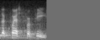
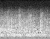
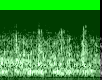
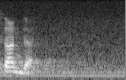
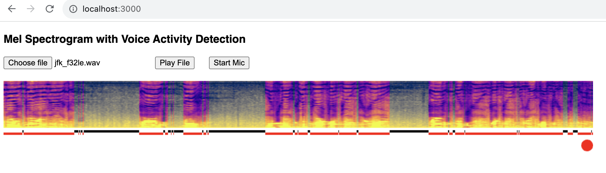
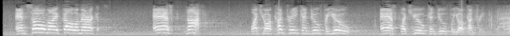

# Mel Spec

[](https://github.com/wavey-ai/mel-spec/actions/workflows/ci.yml)

A Rust implementation of mel spectrograms with support for:
- **Whisper-compatible** mel spectrograms (aligned with whisper.cpp, PyTorch, librosa)
- **Kaldi-compatible** filterbank features (matching kaldi_native_fbank output)
- **NeMo-compatible** mel filters

## Examples

* [stream microphone or wav to mel wasm worker](examples/browser)
* [stream from ffmpeg to whisper.cpp](examples/stream_whisper)
* [convert audio to mel spectrograms and save to image](examples/mel_tga)
* [transcribe images with whisper.cpp](examples/tga_whisper)

## Usage

```rust
use mel_spec::prelude::*;
```

### Kaldi-compatible Filterbank Features

The `fbank` module provides Kaldi-style filterbank features with parity to `kaldi_native_fbank`. This is useful for speaker embedding models like WeSpeaker and pyannote.

```rust
use mel_spec::fbank::{Fbank, FbankConfig};

// Default config matches kaldi_native_fbank defaults
let config = FbankConfig::default();
let fbank = Fbank::new(config);

// Compute features from audio samples (mono, f32, 16kHz)
let features = fbank.compute(&samples);
// Returns Array2<f32> with shape (num_frames, 80)
```

**Kaldi defaults:**
- Sample rate: 16000 Hz
- Mel bins: 80
- Frame length: 25ms (400 samples)
- Frame shift: 10ms (160 samples)
- Window: Povey (like Hamming but goes to zero at edges)
- Preemphasis: 0.97
- CMN: enabled (subtract mean across time)

### Mel Filterbank (Whisper/librosa compatible)

Mel filterbanks within 1.0e-7 of librosa and identical to whisper GGML model-embedded filters.

```rust
use mel_spec::mel::mel;

let sampling_rate = 16000.0;
let fft_size = 400;
let n_mels = 80;
let filters = mel(sampling_rate, fft_size, n_mels, None, None, false, true);
// Returns Array2<f64> with shape (80, 201)
```

### Spectrogram using Short Time Fourier Transform

STFT with overlap-and-save that has parity with PyTorch and whisper.cpp. Suitable for streaming audio.

```rust
use mel_spec::stft::Spectrogram;

let fft_size = 400;
let hop_size = 160;
let mut spectrogram = Spectrogram::new(fft_size, hop_size);

// Add PCM audio samples
let samples: Vec<f32> = vec![0.0; 1600];
if let Some(fft_frame) = spectrogram.add(&samples) {
    // Use FFT result
}
```

### STFT to Mel Spectrogram

Apply a pre-computed filterbank to FFT results. Output is identical to whisper.cpp and whisper.py.

```rust
use mel_spec::mel::MelSpectrogram;
use ndarray::Array1;
use num::Complex;

let fft_size = 400;
let sampling_rate = 16000.0;
let n_mels = 80;
let mut mel_spec = MelSpectrogram::new(fft_size, sampling_rate, n_mels);

let fft_input = Array1::from(vec![Complex::new(1.0, 0.0); fft_size]);
let mel_frame = mel_spec.add(fft_input);
```

### RingBuffer for Streaming

For creating spectrograms from streaming audio, see `RingBuffer` in [rb.rs](src/rb.rs).

### Saving Mel Spectrograms to TGA

Mel spectrograms can be saved as 8-bit TGA images (uncompressed, supported by macOS and Windows). These images encode quantized mel spectrogram data that whisper.cpp can process directly without audio input.

```rust
use mel_spec::quant::{save_tga_8bit, load_tga_8bit};

// Save spectrogram
save_tga_8bit(&mel_data, "spectrogram.tga").unwrap();

// Load and use with whisper.cpp
let mel = load_tga_8bit("spectrogram.tga").unwrap();
```

TGA files are lossless for speech-to-text - they encode all information available in the model's view of raw audio.

```
ffmpeg -i audio.mp3 -f f32le -ar 16000 -ac 1 pipe:1 | ./target/release/tga_whisper -t spectrogram.tga
```


_"the quest for peace."_

### Voice Activity Detection

Uses Sobel edge detection to find speech boundaries in mel spectrograms. This enables real-time processing by finding natural cut points between words/phrases.

`mel-spec` includes a lightweight, model-free VAD for streaming ASR. Instead of
loading a separate neural classifier, it reuses the STFT/log-mel features
already produced for transcription and looks for speech-like spectral structure
plus stable gaps. The result is best used for fast chunking and cut-point
selection; learned VADs such as Silero or TEN-VAD remain better when the primary
requirement is strict speech/non-speech endpointing.

```rust
use mel_spec::vad::{DetectionSettings, VoiceActivityDetector};

let settings = DetectionSettings::default();
let mut vad = VoiceActivityDetector::new(&settings);
```

Speech in mel spectrograms is characterized by clear gradients. The VAD finds vertical gaps suitable for cutting, and drops frames that look like gaps in speech (which cause Whisper hallucinations).

The streaming VAD can also return STFT-derived timestamps when it is constructed
with frame timing:

```rust
use mel_spec::vad::{VadFrameTiming, VoiceActivityDetector};

let timing = VadFrameTiming::new(400, 160, 16_000.0);
let mut vad = VoiceActivityDetector::new_with_timing(&settings, timing);

if let Some(activity) = vad.add_activity(&mel_frame) {
    if let Some(ts) = activity.timestamps {
        println!("active={} center_ms={}", activity.active, ts.center_ms);
    }
}
```

For comparison against a manually annotated VAD set, this repository vendors
the TEN-VAD testset under `testdata/ten-vad`. Run the release evaluator:

```bash
cd examples/vad_ten_eval
cargo run --release
```

The evaluator defaults to the balanced `mel-spec` VAD preset.

Measured locally on the checked-in TEN-VAD testset:

| System | Setting | Macro precision | Macro recall | Macro F1 | Macro FPR | RTFx |
| --- | --- | ---: | ---: | ---: | ---: | ---: |
| `mel-spec` | balanced default | 0.8751 | 0.8785 | 0.8566 | 0.3946 | 819.6 |
| `mel-spec` | high-F1 sweep result | 0.8165 | 0.9635 | 0.8769 | 0.6459 | 828.9 |
| Silero | tuned threshold `0.13` | 0.8897 | 0.9388 | 0.9088 | 0.3602 | 110.3 |
| Silero | default threshold `0.50` | 0.9379 | 0.8630 | 0.8826 | 0.1778 | 110.6 |

Practical read:

- The balanced `mel-spec` default improves the previous lower-FPR preset on
  both macro F1 and false positives: macro F1 `0.8566`, macro FPR `0.3946`,
  and about `820x` realtime.
- A high-F1 sweep result reaches macro F1 `0.8769`, but does so by accepting
  many more false positives: FPR `0.6459`.
- Tuned Silero is still more accurate overall: macro F1 `0.9088`, FPR `0.3602`.
- `mel-spec` is roughly 7.4x faster than Silero in this local run: about `820x`
  realtime vs about `110x`.
- `mel-spec` is useful because it is extremely cheap and reuses ASR mel/STFT
  features. For production endpointing or strict silence rejection, Silero or
  TEN-VAD is still a better fit.

TEN-VAD is the source of the labels; upstream reports a stronger
precision/recall curve than Silero/WebRTC on this same testset.

Detailed method, provenance, commands, speed notes, and per-file results are in
[doc/vad/README.md](doc/vad/README.md).


**Examples from JFK speech:**

Energy but no speech - VAD correctly rejects:



Fleeting word - VAD correctly detects:



Full JFK transcript with VAD: [jfk_transcript_golden.txt](doc/jfk_transcript_golden.txt)

### Hush Demo

The old Hush live demo is no longer hosted, but the source remains at
[wavey-ai/hush](https://github.com/wavey-ai/hush). The browser graphic below
shows the original interactive view.



## Performance

### CPU Performance

Benchmarks on Apple M1 Pro (single-threaded, release build):

| Audio Length | Frames | Time | Throughput |
|-------------|--------|------|------------|
| 10s | 997 | 21ms | 476x realtime |
| 60s | 5997 | 124ms | 484x realtime |
| 300s (5 min) | 29997 | 622ms | 482x realtime |

Full mel spectrogram pipeline (STFT + mel filterbank + log) at 16kHz, FFT size 512, hop 160, 80 mel bins.

**CPU performance is excellent** - processing 5 minutes of audio in 622ms means the library is ~480x faster than realtime on a single core.

### GPU Acceleration

This library still defaults to a pure Rust CPU implementation, but there is now an experimental native `wgpu` backend for batched mel spectrogram generation on GPU-capable native systems.

```rust
#[cfg(all(feature = "wgpu", not(target_arch = "wasm32")))]
{
    use mel_spec::wgpu::WgpuMelSpectrogram;

    let gpu = WgpuMelSpectrogram::new(512, 160, 16_000.0, 80)?;
    let mel = gpu.compute_mel_spectrogram(&samples)?;
}
```

Current limitations:

* CUDA support is available behind the `cuda` feature for NVIDIA systems; it uses cuFFT for STFT and a CUDA kernel for mel projection
* Batched API only - this backend is not wired into the streaming `Spectrogram::add` path
* Power-of-two FFT sizes use the staged GPU FFT path; non-power-of-two sizes such as Whisper's `400` use a Bluestein FFT path on GPU
* Large native batches are internally split to stay within the GPU's storage-buffer binding limits
* The GPU path currently uses `f32`, so expect small numeric drift versus the CPU's `f64` path

For other GPU options, consider:

| Option | Speedup | Notes |
|--------|---------|-------|
| **Built-in `cuda` backend** | Experimental | NVIDIA-only, uses cuFFT directly so Whisper's `fft_size = 400` works without custom FFT code |
| **Built-in `wgpu` backend** | Experimental | Native Rust, works on Metal/Vulkan/DX12 capable systems, including Whisper's `fft_size = 400` via Bluestein |
| **NVIDIA NeMo** | ~10x over CPU | Python/PyTorch, uses cuBLAS/cuDNN, best for batch processing |
| **torchaudio** | ~5-10x | Python/PyTorch, CUDA backend |

**Options:**

1. **Built-in `cuda` backend** → Best fit for NVIDIA Linux boxes where cuFFT is available and you want the most direct path to fast `fft_size = 400`
2. **Built-in `wgpu` backend** → Native Rust, experimental today, best if you want to run on Apple Silicon or other non-CUDA GPUs
3. **NeMo / torchaudio** → Python/PyTorch with CUDA, best for batch processing
4. **TensorRT / ORT TensorRT EP** → Useful for model inference, but not a simpler replacement for mel preprocessing

The historical `gpu` branch has effectively been superseded by the in-tree `cuda` feature and the native `wgpu` backend.

## Discussion

* Mel spectrograms encode at 6.4KB/sec (80 x 2 bytes x 40 frames)
* Float PCM for Whisper is 64KB/sec at 16kHz

whisper.cpp produces mel spectrograms with 1.0e-6 precision, but these are invariant to 8-bit quantization. We can save as 8-bit images without losing useful information.

**We only need 1.0e-1 precision for accurate results**, and rounding may actually improve some difficult transcriptions:

```
Original:  [0.158, 0.266, 0.076, 0.196, 0.167, ...]
Rounded:   [0.2,   0.3,   0.1,   0.2,   0.2,   ...]
```

Once quantized, the spectrograms are the same:



_(top: original, bottom: rounded to 1.0e-1)_

Speech is encapsulated almost entirely in the frequency domain, and the mel scale effectively divides frequencies into 80 bins. 8-bits of grayscale is probably overkill - it could be compressed further.
