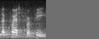
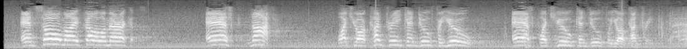
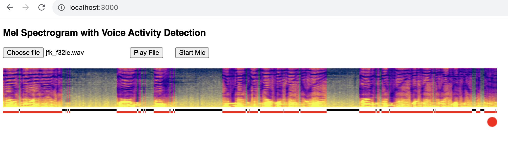

# Mel Spec

[](https://github.com/wavey-ai/mel-spec/actions/workflows/ci.yml)

Rust mel spectrogram, filterbank, and VAD components for ASR systems.

**Release note:** `0.5.0` makes CPU feature extraction faster. The CPU paths
use a real-input FFT, and the batch paths project eight frames at a time.
Results match `0.4.1` within FFT rounding. Details are in
[CHANGELOG.md](CHANGELOG.md).

| Speedup (11 s JFK sample, one Apple M1 core) | |
| --- | ---: |
| Batch log-mel | 1.9-2.0x |
| Whisper mel | 1.7-2.0x |
| Kaldi fbank | 1.5x |
| VAD | 3.7x |

## Main Features

| Feature | API | Use |
| --- | --- | --- |
| Batch log-mel frontend | `BatchLogMelSpectrogram` | Whole-utterance log-mel features with centered framing, pre-emphasis, padding, and per-feature normalization. The Parakeet/NeMo frontend in `asr-api` uses it. |
| Whisper-compatible mel | `Spectrogram`, `MelSpectrogram` | Streaming and batch log-mel spectrograms that match whisper.cpp, PyTorch, and librosa. |
| Kaldi-compatible fbank | `Fbank` | Kaldi-style filterbank features with the Povey window, the Kaldi mel scale, and CMN. |
| Mel filterbanks | `mel`, `SparseMelFilterbank` | Slaney or HTK filterbank matrices, and the sparse form that the CPU paths execute. |
| Streaming input | `RingBuffer` | Bounded sample buffer that gives one mel frame for each hop. The `rtrb` feature uses an `rtrb` ring buffer. |
| Interleaved PCM | `compute_interleaved`, `downmix_interleaved` | Downmix of stereo or multichannel PCM before batch feature extraction. |
| Model-free VAD | `VoiceActivityDetector`, `vad_boundaries` | Speech decisions and timestamps from the edge structure of mel frames. |
| TGA mel images | `tga_8bit`, `save_tga_8bit`, `load_tga_8bit` | Quantized 8-bit mel spectrograms in TGA files. |
| WASM worker | `SpeechToMel` (`wasm` feature) | Mel frames, quantization, and VAD in a browser worker. Hush uses it for local Whisper transcription. |
| GPU backends | `WgpuMelSpectrogram`, `CudaMelSpectrogram` | Experimental batched mel generation with `wgpu` (Metal, Vulkan, DX12) or `cuda` (NVIDIA). |

## Quick Start

```rust
use mel_spec::prelude::*;

let samples = vec![0.0_f32; 16_000];
let mel_frames = Spectrogram::compute_mel_spectrogram_cpu(
    &samples,
    400,
    160,
    80,
    16_000.0,
);

println!("frames={}", mel_frames.len());
```

For whole utterances, `BatchLogMelSpectrogram` gives feature-major output. Keep
the scratch buffers to reuse them across calls:

```rust
use mel_spec::prelude::*;

let frontend = BatchLogMelSpectrogram::new(BatchLogMelConfig::default()).unwrap();
let mut scratch = frontend.scratch();
let samples = vec![0.0_f32; 16_000];
let features = frontend.compute_with_scratch(&samples, &mut scratch).unwrap();

assert_eq!(features.shape(), &[80, 101]);
```

Use `BatchLogMelSpectrogram::compute_interleaved` for interleaved audio. The
method averages all input channels before feature extraction.

The focused API examples are kept in the example READMEs so the top-level
README stays readable:

| Example | Description |
| --- | --- |
| [browser](examples/browser) | Stream microphone or WAV audio to a WASM mel worker. |
| [mel_tga](examples/mel_tga) | Convert raw audio to TGA mel spectrogram images. |
| [tga_whisper](examples/tga_whisper) | Transcribe precomputed TGA mel spectrograms with whisper.cpp. |
| [stream_whisper](examples/stream_whisper) | Stream ffmpeg audio through mel, VAD, and Whisper. |
| [vad_ten_eval](examples/vad_ten_eval) | Evaluate `mel-spec` VAD against the vendored TEN-VAD testset. |

## Voice Activity Detection

`mel-spec` includes a lightweight, model-free VAD. It does not load a neural VAD
runtime. It looks for speech-like Sobel edge structure in mel spectrogram frames
and can attach STFT-derived timestamps to each decision.

Current balanced default on the checked-in TEN-VAD testset:

| System | Setting | Macro precision | Macro recall | Macro F1 | Macro FPR | RTFx |
| --- | --- | ---: | ---: | ---: | ---: | ---: |
| `mel-spec` | balanced default | 0.8751 | 0.8785 | 0.8566 | 0.3946 | 819.6 |
| `mel-spec` | high-F1 sweep result | 0.8165 | 0.9635 | 0.8769 | 0.6459 | 828.9 |
| Silero | tuned threshold `0.13` | 0.8897 | 0.9388 | 0.9088 | 0.3602 | 110.3 |
| Silero | default threshold `0.50` | 0.9379 | 0.8630 | 0.8826 | 0.1778 | 110.6 |

The balanced default is not trying to beat learned VADs at strict endpointing.
It is a fast built-in option that reuses ASR mel features and avoids another
model dependency. Tuned Silero is still more accurate overall. TEN-VAD is the
source of the labels and upstream reports stronger precision/recall than Silero
and WebRTC on the same testset.

Detailed method, provenance, commands, speed notes, and per-file results are in
[doc/vad/README.md](doc/vad/README.md).

## TGA Spectrograms

TGA spectrograms are useful when you want a simple interchange format for mel
features. They can be inspected as images, spliced, stored, and passed to the
Whisper examples without keeping the original audio around.

This path is live in Hush as local browser ASR. The browser uses the
Whisper-compatible log-mel output from `mel-spec`. It stores captured speech as
compact 8-bit TGA images. It decodes the images to an 80-mel `Float32Array` and
passes the tensor to `whisper_set_mel` in a custom `whisper.cpp` WASM binding.
The active Hush deployment verifies that local WASM Whisper
can transcribe from the mel tensor without posting microphone audio to a server.
This uses the proposed direct-mel entry point for `whisper.cpp`,
not the stock browser example that feeds PCM audio into `whisper.wasm`.


_"the quest for peace."_

Mel spectrograms are also robust under heavy quantization. Whisper does not need
high-precision PCM after projection into mel space. Eight-bit TGA images
preserve the information that the model sees. Coarse mel-value rounding can
also retain useful transcription quality.

```text
Original: [0.158, 0.266, 0.076, 0.196, 0.167, ...]
Rounded:  [0.2,   0.3,   0.1,   0.2,   0.2,   ...]
```



_(top: original mel values, bottom: values rounded to 1.0e-1 before image
quantization)_

## Performance

`mel-spec` 0.5.0 on the 11-second JFK sample, one Apple M1 core, release build:

| Path | Time | Realtime factor |
| --- | ---: | ---: |
| `BatchLogMelSpectrogram`, Parakeet configuration | 1.13 ms | 9,700x |
| `BatchLogMelSpectrogram`, default configuration | 0.95 ms | 11,600x |
| `Spectrogram::compute_mel_spectrogram_cpu` (Whisper) | 1.97 ms | 5,600x |
| `Spectrogram::add` and `MelSpectrogram::add` (Whisper, streaming) | 2.53 ms | 4,300x |
| `RingBuffer` | 2.34 ms | 4,700x |
| `Fbank::compute` | 2.13 ms | 5,200x |
| `VoiceActivityDetector::add_activity` | 0.23 ms | 47,000x |

The Parakeet configuration has 128 mels, pre-emphasis 0.97, and per-feature
normalization. The time increases linearly with the audio length: 66 seconds of
audio take 6.8 ms in the Parakeet configuration.

`mel()` and the Kaldi filterbank builder produce dense filterbank matrices for
reference, fixture comparison, and interchange with other toolchains. The CPU
paths execute a sparse form of the same matrices, with one contiguous band of
weights for each mel row. Tests compare the sparse projection with the dense
matrices.

### Parakeet/NeMo Frontend Comparison

`asr-api` uses `BatchLogMelSpectrogram` for its Parakeet/TDT frontend. The
`parakeet_featurizer_bench` harness in `asr-torch` compares this frontend with a
CPU TorchScript trace of the NeMo Parakeet featurizer (`featurizer_cpu.pt`). The
comparison used the JFK sample on an M1 Mac and `mel-spec` 0.4.0.

| Featurizer | Shape | Mean | p50 | p95 | RTFx |
| --- | --- | ---: | ---: | ---: | ---: |
| Rust Parakeet frontend using `mel-spec` 0.4.0 | `128x1101` | `2.341ms` | `2.334ms` | `2.406ms` | `4699.62` |
| TorchScript CPU trace | `128x1101` | `2.244ms` | `2.206ms` | `2.813ms` | `4902.22` |

Feature comparison across the full tensor:

| Metric | Value |
| --- | ---: |
| MAE | `0.001183` |
| RMSE | `0.023699` |
| Max absolute error | `3.965733` |
| Correlation | `0.999719` |

The `mel-spec` benchmark gives 2.26 ms for 0.4.1 and 1.13 ms for 0.5.0 in this
configuration. On the first three seconds of the JFK sample, the 0.5.0 features
differ from 0.4.1 by a mean absolute difference of 1.2e-6.

### GPU Backends

The CPU path is the default. Experimental native GPU backends are available
behind feature flags:

| Feature | Backend |
| --- | --- |
| `cuda` | NVIDIA-only cuFFT plus CUDA mel projection. |
| `wgpu` | Native Rust GPU backend for Metal, Vulkan, and DX12 systems. |

## Build Checks

The top-level library tests do not automatically build every standalone example
crate. Use these commands when changing examples:

```bash
cargo test --release
MEL_SPEC_FUZZ_SCALE=50 cargo test --release fuzz_
cargo build --release --manifest-path examples/mel_tga/Cargo.toml
cargo build --release --manifest-path examples/stream_whisper/Cargo.toml
cargo build --release --manifest-path examples/tga_whisper/Cargo.toml
cargo run --release --manifest-path examples/vad_ten_eval/Cargo.toml
(cd examples/browser && npm ci && npm test)
```

`MEL_SPEC_FUZZ_SCALE` multiplies the number of cases in the seeded random
tests. The Whisper examples compile against the `wavey-ai/whisper-rs` fork and
require a GGML Whisper model to run inference.

## Hush Demo

The Hush live browser demo is active at:

```text
https://wavey.ai/code/hush/?v=20260515-35
```

The source remains at [wavey-ai/hush](https://github.com/wavey-ai/hush). With
the current tuned settings it works as a live browser VAD, spectrogram debugging
view, and local Whisper WASM transcription demo. It exposes mel structure, Sobel
edges, ridge tracks, candidate speech regions, and the local transcript in real
time. The VAD itself should still be treated as experimental rather than a
drop-in replacement for a learned VAD. One strong use case is as a browser-side
feature/debugging front end or cheap prefilter before a stronger VAD/ASR model.


