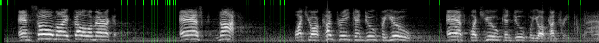

# Mel Spec

A Rust implementation of mel spectrograms aligned to the results from the
whisper.cpp, pytorch and librosa reference implementations and suited to
streaming audio.

### Whisper inference with 8-bit images (or bytestreams)

Passing whisper.cpp mel spectrogram segments directly (via whisper-rs's
set_mel binding):


`[_BEG_] fellow Americans.[_TT_43]`


`[_BEG_] ASK![_TT_51]`


`[_BEG_] NOT![_TT_25]`

Mel spectrograms can be used as a primary API for whisper: encode once - in
real-time - retrieve for inference.

This also opens up interesting possibilities for real-time inference - rather
than looking for attack transients in PCM for voice activity detection - urgh -
we can use edge detection! 

The `vad_boundaries` method takes a Mel spectrogram of any size and demarcates
the time indexes that aren't intersected by feature gradients. Due to the
structure of mel spectrograms, such gradients can be used as a proxy for speech:



(The Sobel operator works remarkably well for this and has real-time speed.)

In a real-time scenario we might choose to send data to whisper, say, whenever
we encounter a non-intersection and have accumulated at least a second of
spectrogram data.

```
let dequantized_mel = load_tga_8bit(file_path).unwrap();
let edge_info = edge_detect(&dequantized_mel, n_mels, 1.0, 5);
```

(See vad.rs [vda.rs](./src/vad.rs))

With quantised mel spectrograms there is zero information loss with respect to
the model's view on the original audio data - but 10x data saving, before
compression.

* Mel spectrograms encode at 6.4Kb /sec (80 * 2 bytes * 40 frames)
* Float PCM required by whispser audio APIs is 64Kb /sec at 16Khz
    - expensive to reprocess
    - resource intensive to keep PCM in-band for overlapping

### mel filter banks

Mel filter banks are within 1.0e-7 of `librosa.filters.mel` and identical to
the GGML model-embedded filters used by whisper.cpp.

### stft - FFT on a stream with overlapping windows

A stft implementation that allows creating spectrograms from an audio steam -
near identical to those produced by whisper.cpp internally.

An example of whisper inference from mel spectrograms via `whisper-rs` can be
found in the tests.

### quantisation

Mel spectrograms can be saved in Tga format - an uncompressed image format
supported by OSX and Windows.

Tga images can be created from any audio input, cropped in Photoshop and reused:

```
let range = save_tga_8bit(&mel_spectrogram, n_mels, file_path).unwrap();
// do something with the image - maybe splice it to isolate a particular feature,
// and resave it
let dequantized_mel = load_tga_8bit(file_path, &range).unwrap();
// load with whisper-rs
state.set_mel(&dequantized_mel).unwrap();
```

## using with whisper-rs and whisper.cpp

Please refer to these PRs, both whisper.cpp and whisper-rs require small
changes:

<s>https://github.com/tazz4843/whisper-rs/pull/75</s> - merged, use master.
https://github.com/ggerganov/whisper.cpp/pull/1130


### Discussion

whisper.cpp produces mel spectrograms with 1.0e-6 precision. However,
these spectrograms are invariant to 8-bit quantisation: we can save them
as 8-bit images and not lose useful information - not lose any *actual*
information about the sound wave at all.

Heisenberg's Uncertainty Principle puts a limit on how much resolution a
spectrogram can have - the more we zoom in on a wave, the more blurry it
becomes. 

Time stretching by overlapping (whisper uses a 60% overlap) mitigates this,
to a point. But after that more precision doesn't mean more accuracy,
and may actually cause noise:

Indeed, *we only need 1.0e-1 precision to get accurate results*, and
rounding to 1.0e-1 seems more accurate for some difficult transcriptions.


Consider these samples from the jfk speech used in the original whisper.py
tests:

```
[src/lib.rs:93] &mel_spectrogram[10..20] = [
    0.15811597,
    0.26561865,
    0.07558561,
    0.19564378,
    0.16745868,
    0.21617787,
    -0.29193184,
    0.12279237,
    0.13897367,
    -0.17434756,
]
```
```
[src/lib.rs:92] &mel_spectrogram_rounded[10..20] = [
    0.2,
    0.3,
    0.1,
    0.2,
    0.2,
    0.2,
    -0.3,
    0.1,
    0.1,
    -0.2,
]
```

Once quantised, the spectrograms are the same:


(top: not rounded, botton: rounded to 1.0e-1)

A lot has to do with how speech can be encapsulated almost entirely in
the frequency domain, and how effectively the mel scale divides those 
frequencies into 80 bins. 8-bytes of 0-255 grayscale is probably
overkill even to measure the total power in each of those bins - it
could be compressed even further.
